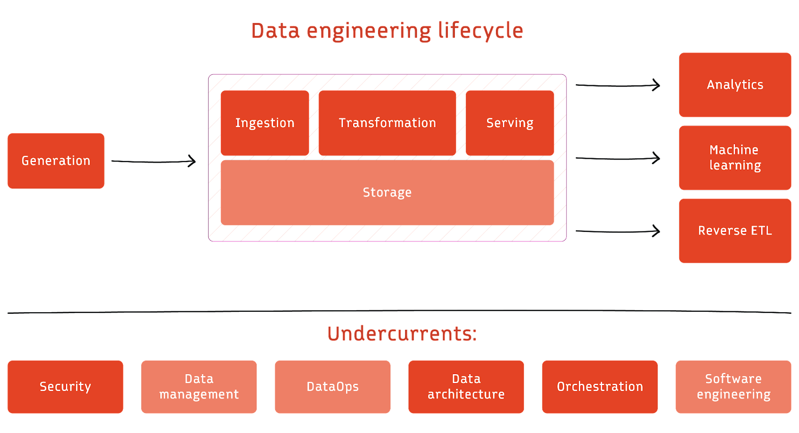

    

    

# NBA Data Engineering Project
Welcome to my personal data engineering project!

This features a full end-to-end data platform focused around the Data Engineering Life Cycle
and utilizing a cloud platform and Docker.

# Overview

This project aims to explore new tools and platforms while documenting the progress on [Medium](https://medium.com/@digitalghost-dev). It also serves as an improvement upon my previous [project](https://github.com/digitalghost-dev/premier-league).
Additionally, I will track and share the costs of each paid service used, making it easier for others to replicate and learn from this project.

---
More to come...