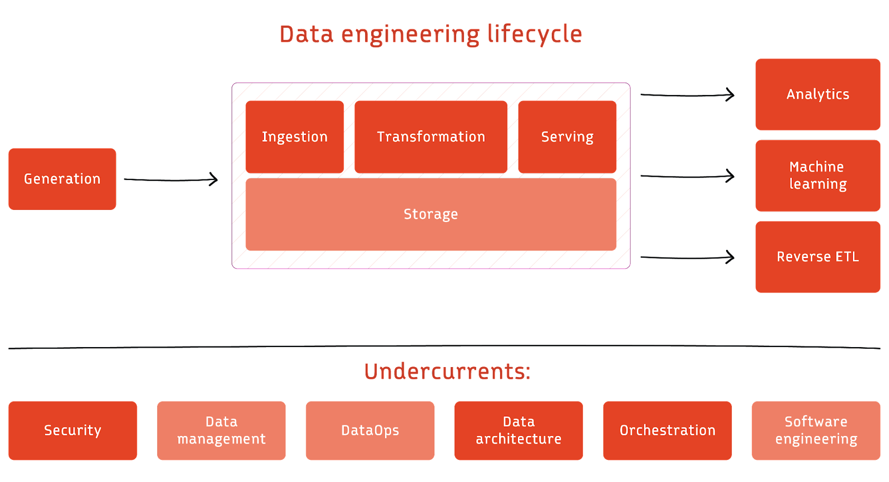

# Introduction

Welcome to the documentation of my NBA data engineering project!

Here, I have instructions for how every piece was built for the project. 

I also write in more detail about my journey through this project on [Substack](https://digitalghostdev.substack.com/p/nba-data-engineering-part-i-exploration?r=2txtfr) if you're interested in that. It dives into my thought process for each decision I made.

---

# Structure

This documentation is sectioned into different parts that reflect the data engineering life cycle or at leasts tries.

---

# Important Links
* [GitHub Repository](https://github.com/digitalghost-dev/nba_data)