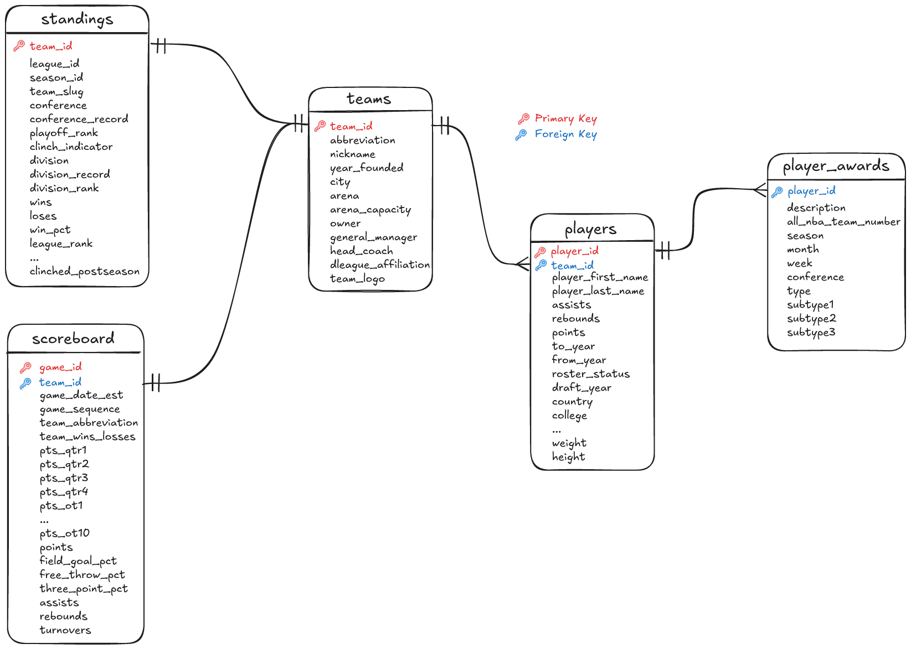

# Storage

## Data Model

The data model 

## DuckDB on Motherduck
Storage for this project uses [DuckDB](https://duckdb.org/), a fast analytical and in-process database system.
DuckDB can be installed on all operating systems and is meant to be used as an OLAP database.

[Motherduck](https://motherduck.com) is a serverless DuckDB in the cloud. 